**Idioma**: 🇧🇷 <a href="https://github.com/AndreDrummer/tiutiu/blob/main/readme.md">Português Brasileiro</a> | 🇺🇸 <a href="https://github.com/AndreDrummer/tiutiu/blob/main/readme-en-us.md">Inglês Americano</a>

#  Tiu, Tiu

# Plataforma de Adoção e Doação de Animais 🐾

<table>  
  <tr>
    <td>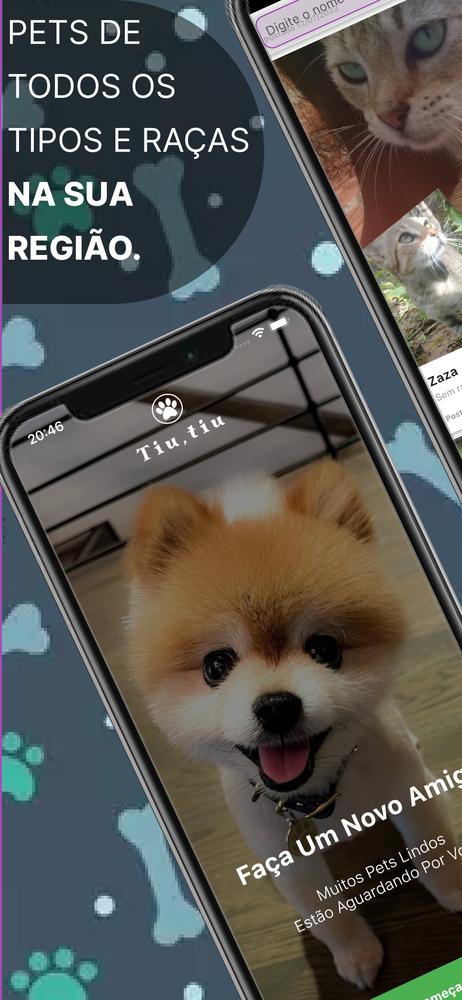</td>    
    <td>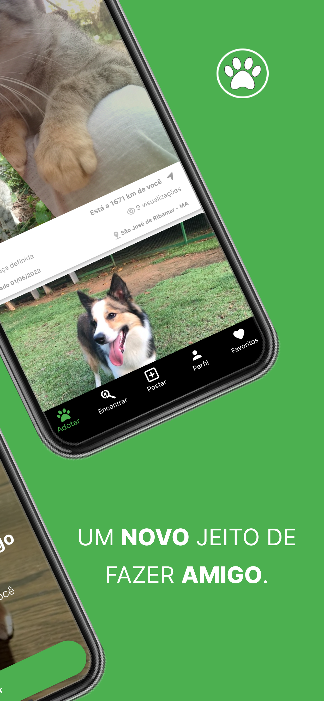</td>    
    <td>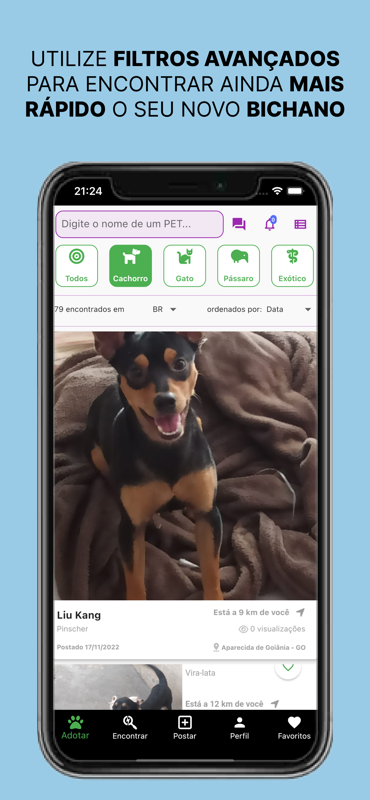</td>    
    <td>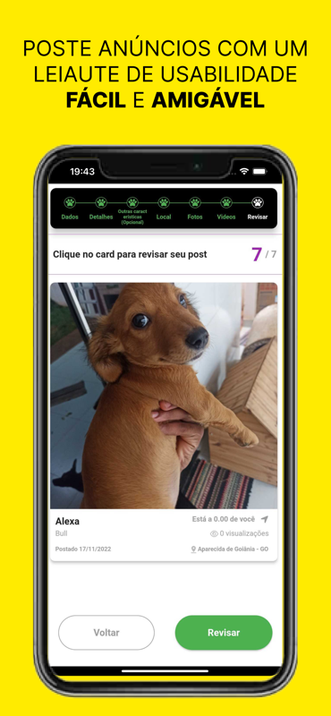</td>    
    <td>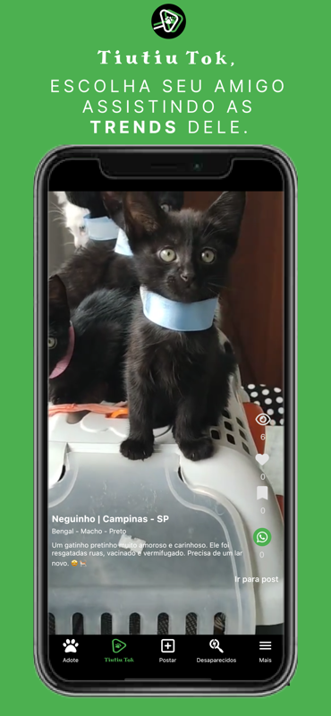</td>    
    <td>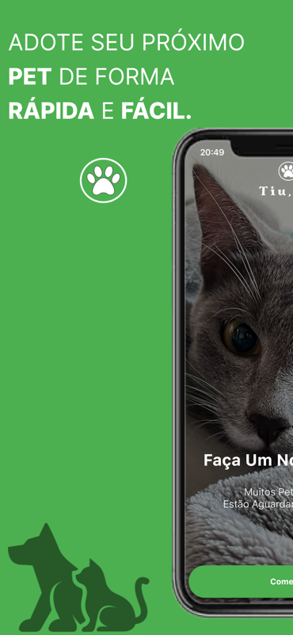</td>    
    <td></td>    
    <td>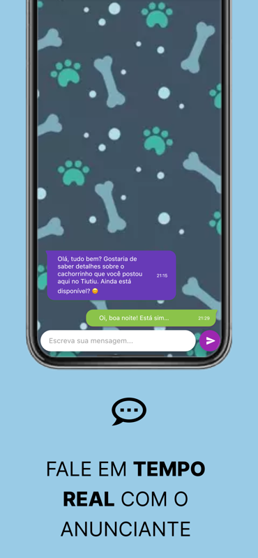</td>    
    <td>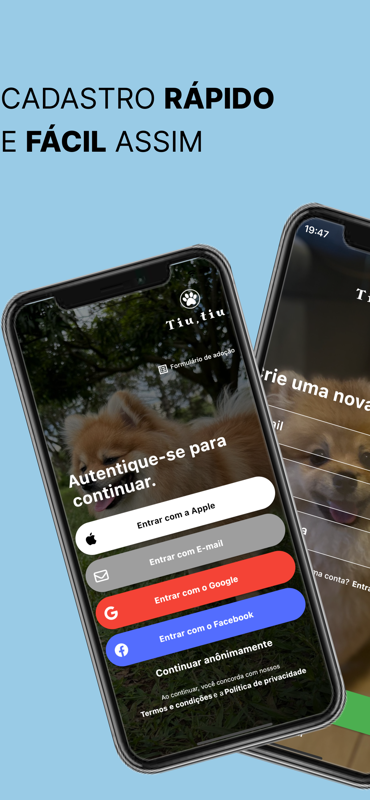</td>    
    <td>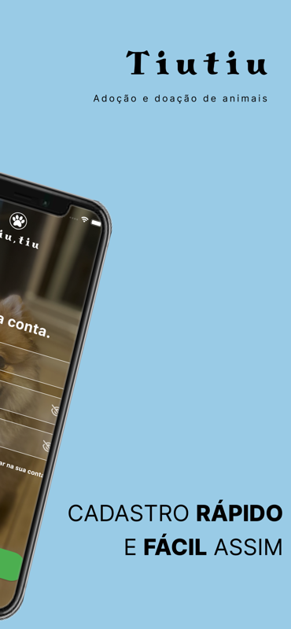</td>    
  </tr>  
</table>

O **Tiu, Tiu** é um aplicativo poderoso e intuitivo criado para facilitar o processo de adoção e doação de animais. Com uma série de funcionalidades robustas, nossa missão é conectar adotantes e doadores, garantindo que mais animais encontrem lares amorosos. Além disso, proporcionamos uma experiência de uso moderna, com vídeos, geolocalização, chat integrado e muito mais!

---

## 📸 Capturas de telas

| Tela Inicial                                     | Tela de Filtros                                        | TiuTok                                 |
| ------------------------------------------------ | ------------------------------------------------------ | -------------------------------------- |
|  |  |  |

---

## ⬇ Baixe nas lojas de aplicativos

### Disponível para Android e iOS 
<p>
  <a href="https://play.google.com/store/apps/details?id=com.anjasolutions.tiutiu&hl=pt">
    
  </a>

  <a href="https://apps.apple.com/br/app/tiutiu-ado%C3%A7%C3%A3o-de-animais/id1660325927">
    
  </a>
</p>


---

## 🌟 Funcionalidades Principais

### 🐾 Cadastro para Doação
Doar um animal nunca foi tão fácil! Com poucos cliques, você pode criar um anúncio completo, incluindo fotos, descrições detalhadas e informações essenciais sobre o pet. O Tiu, Tiu também permite o acompanhamento das interações de potenciais adotantes em tempo real.

<table>
  <tr>
    <td align="center" colspan="3">Telas de Cadastro</td>
  </tr>  
  <tr>
    <td></td>
    <td></td>
    <td></td>    
  </tr>  
</table>

### 📱 Adoção Facilitada
Encontre o animal ideal para adoção com nossos **filtros avançados**, que permitem buscas por raça, porte, idade, localização e outras características. O processo foi otimizado para que você encontre o companheiro perfeito rapidamente.

### 🎥 TiuTok: Vídeos de Animais para Adoção
A **seção TiuTok** oferece uma experiência inovadora e envolvente, permitindo que você explore vídeos de animais disponíveis para adoção em uma interface contínua, semelhante ao TikTok. Descubra seu próximo amigo enquanto curte e compartilha vídeos adoráveis de pets!

<table>
  <tr>
    <td align="center" colspan="3">TiuTok</td>
  </tr>  
  <tr>
    <td>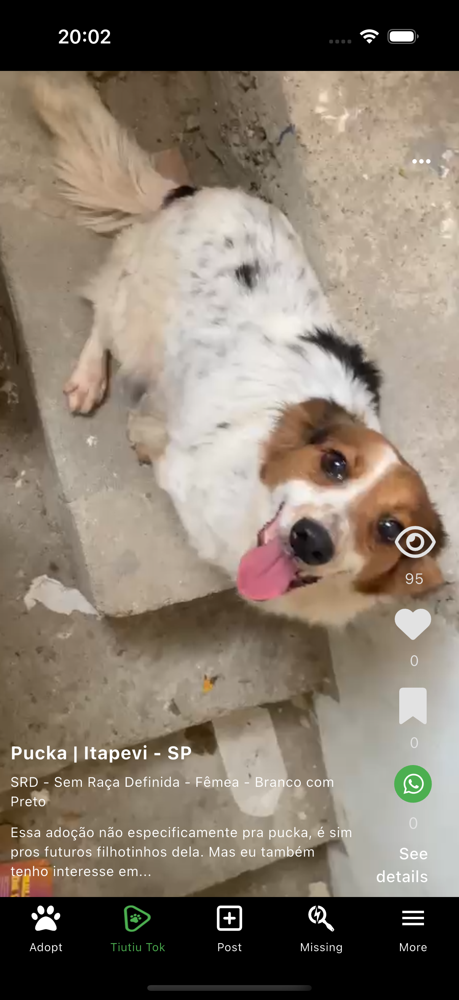</td>
    <td></td>    
    <td></td>    
  </tr>  
</table>

### 🌍 Geolocalização Avançada
Nossa funcionalidade de **geolocalização avançada** permite que você encontre animais para adoção perto de sua localização atual. Isso facilita ainda mais o processo, ajudando a conectar adotantes a animais que estão próximos.

<table>
  <tr>
    <td align="center" colspan="2">Disponível Mundialmente</td>
  </tr>  
  <tr>
    <td></td>
    <td></td>    
  </tr>  
</table>

### 🔗 Integração com Redes Sociais
Compartilhe perfis de animais diretamente em suas redes sociais favoritas, como Instagram, Facebook e WhatsApp. Cada compartilhamento ajuda a aumentar a visibilidade de animais que precisam de um novo lar!

<table>
  <tr>
    <td align="center" colspan="3">Login e compartilhamento nas Redes Sociais</td>
  </tr>  
  <tr>
    <td></td>
    <td>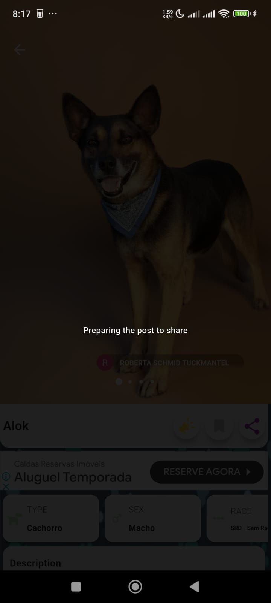</td>
    <td></td>    
  </tr>  
</table>

### 💬 Chat In-App
Com nosso **chat integrado**, adotantes e doadores podem se comunicar diretamente dentro do aplicativo, facilitando o processo de adoção. Perguntas sobre o animal, informações adicionais ou mesmo agendar visitas podem ser resolvidas rapidamente com o chat em tempo real.

<table>
  <tr>
    <td align="center" colspan="2">Chat Integrado</td>
  </tr>  
  <tr>
    <td></td>
    <td></td>    
  </tr>  
</table>

### 🔔 Notificações Push
Fique por dentro de novas oportunidades e interações com as **notificações push**. Receba alertas sobre novos animais disponíveis, mensagens no chat e atualizações dos seus anúncios de doação, tudo de forma conveniente.

<table>
<tr>
    <td align="center" colspan="2">Notificações em Segundo Plano</td>
  </tr> 
<tr>
<td></td>
<td></td>
</tr>
</table>

### 📊 Estatísticas de Adoção
Monitore o desempenho dos seus anúncios com **estatísticas detalhadas**. Saiba quantas visualizações o perfil de um animal teve, quantos contatos foram feitos e acompanhe o progresso até a adoção.

<table>
<tr>
    <td align="center" colspan="2">Formulário de Adoção e Meus Posts</td>
  </tr> 
<tr>
<td></td>
<td></td>
</tr>
</table>


### 🎯 Sistema de Favoritos
Adicione animais ao seu **sistema de favoritos**, facilitando o acompanhamento de pets que você tem interesse em adotar. Acompanhe seus favoritos e receba atualizações caso haja alguma mudança de status no processo de adoção.

<table>
  <tr>
    <td align="center" colspan="2">Favoritos</td>
  </tr>  
  <tr>
    <td>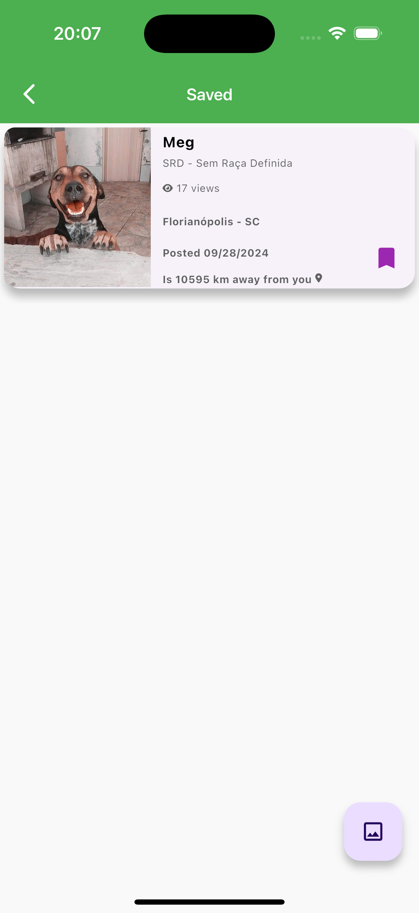</td>
    <td></td>    
  </tr>  
</table>

## 🚀 Tecnologias Utilizadas

O **Tiu, Tiu** foi construído com um conjunto de tecnologias modernas para oferecer a melhor experiência ao usuário:

- **Flutter**: Framework utilizado para garantir um aplicativo fluido tanto em Android quanto em iOS.
- **Firebase**: Implementado para autenticação, banco de dados em tempo real, notificações push, e mais.
  - **Firebase Functions**: Para lógica de backend em nuvem.
  - **Firebase Dynamic Links**: Para links dinâmicos que redirecionam para o app.
  - **Firebase Crashlytics**: Para monitoramento e correção de erros.
  - **Firebase Firestore**: Banco de dados NoSQL em tempo real.
  - **Firebase Firestorage**: Para armazenamento de imagens e vídeos.
  - **Firebase Hosting**: Utilizado para hospedar o site oficial.
- **REST API**: Para sincronização de dados eficiente e rápida.
- **Manipulação de Imagens e Vídeos**: Tratamento de mídia dentro do app, incluindo edição e upload.
- **Geolocalização Avançada**: Para encontrar animais próximos ao usuário.
- **Construção de PDFs**: Para geração de formulários de adoção personalizados diretamente no app.


---

## 🔮 Roadmap Futuro

Veja o que planejamos para as próximas versões:
- [ ] 📍 Mapa de Abrigos.
- [ ] ▶️  Melhorias na interface do TiuTok.
- [ ] 🤖 IA para Sugestão de Animais: Uso de inteligência artificial para recomendar animais com base nas preferências do usuário e no histórico de adoções.
- [ ] 🎮 Gamificação: Implementação de um sistema de recompensas para incentivar os usuários a engajar mais na plataforma, como ao completar perfis de doação.


---

## 📜 Licença
Este projeto está licenciado sob a [MIT License](LICENSE). Sinta-se à vontade para usar e modificar conforme necessário.

---

## 🛠️ Como Configurar e Executar

Quer contribuir ou rodar o **Tiu, Tiu** localmente? Siga as etapas abaixo para configurar o ambiente:

1. Clone o repositório:
   ```bash
   git clone https://github.com/AndreDrummer/tiutiu.git
   ```
2. Instale as dependências:
   ```bash
   flutter pub get
   ```
3. Configure os idiomas:
   ```bash
   flutter gen-l10n
   ```
4. Execute o aplicativo:
   ```bash
   flutter run
   ```

---

## 🌍 Links Importantes

- [Baixe o Tiu, Tiu na Play Store](https://play.google.com/store/apps/details?id=com.anjasolutions.tiutiu&hl=pt)
- [Baixe o Tiu, Tiu na Apple Store](https://apps.apple.com/br/app/tiutiu-ado%C3%A7%C3%A3o-de-animais/id1660325927)
- [Acesse o site oficial](https://www.anjasolutions.com/tiutiu)
- [Visite o repositório no GitHub](https://github.com/AndreDrummer/tiutiu)

---

## 🤝 Como Contribuir

Contribuições são bem-vindas! Se você deseja ajudar no desenvolvimento do **Tiu, Tiu**, siga os passos abaixo:

1. Faça um **fork** do repositório.
2. Crie uma **branch** para suas modificações.
3. Envie um **Pull Request** com suas sugestões.

Vamos construir juntos uma plataforma que ajude mais animais a encontrar seus lares para sempre!

## ⬇ Baixe agora

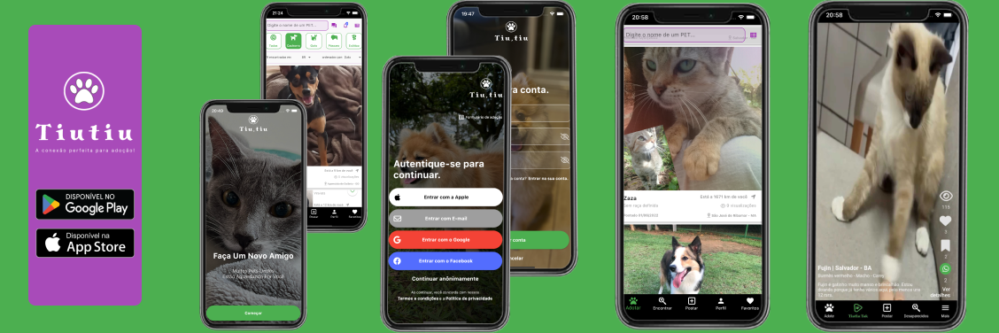

<p>
  <a href="https://play.google.com/store/apps/details?id=com.anjasolutions.tiutiu&hl=pt">
    
  </a>

  <a href="https://apps.apple.com/br/app/tiutiu-ado%C3%A7%C3%A3o-de-animais/id1660325927">
    
  </a>
</p>